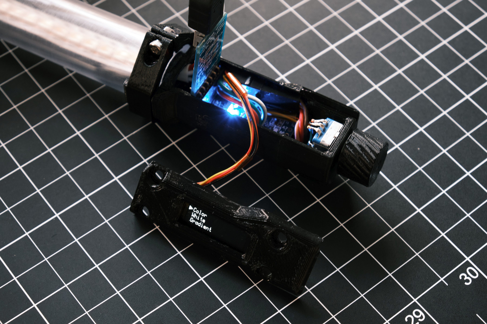
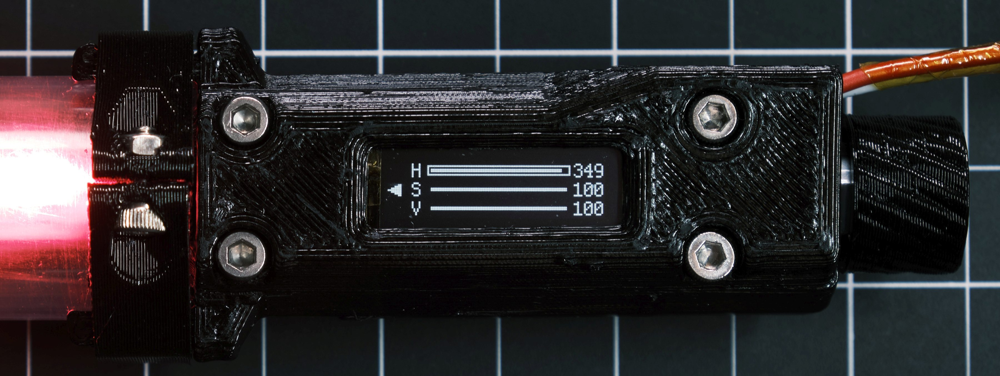
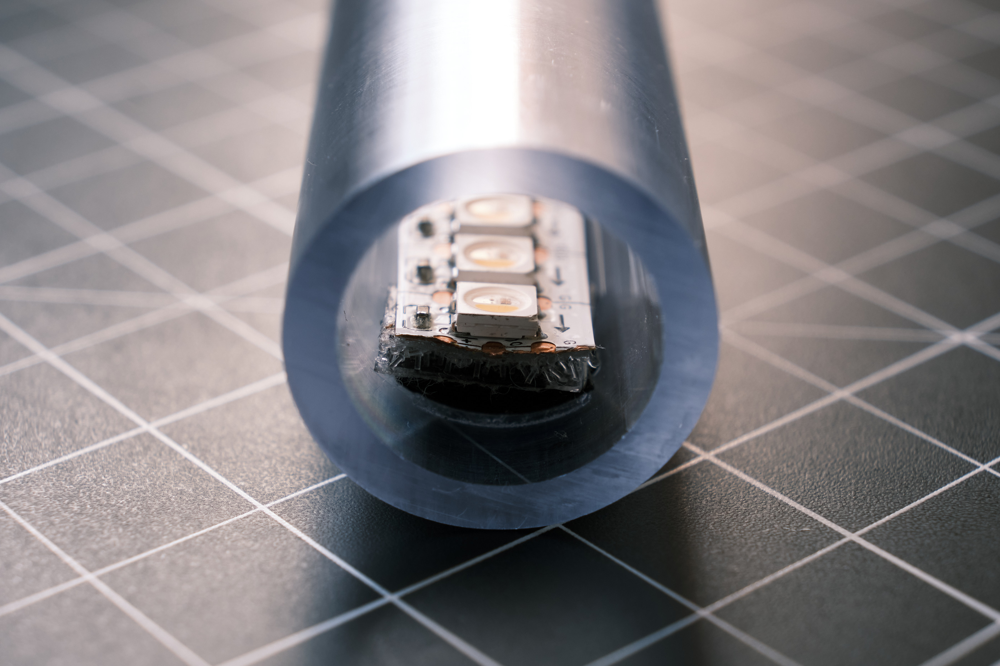

# Glowstick


## Features
* Full onboard control with OLED display and rotary encoder
* Uses a SK6812 LED strip for white and RGB light
* Color, white, and gradient modes for full control over lighting
* Animation modes for light painting
* Powered over USB or any other 5V source
* BOM cost less than US$50 for a 24" long light

## Hardware




### Components used
* Arduino Pro Mini or Pololu A-Star 328PB Micro
* SK6812 RGBW LED strip, 1m length, 144 LED/m IP30
* SSD1306 I2C OLED display breakout board, 128x32 pixels
* EC11 series rotary encoder, push button switch, 15mm knurled shaft (EC11M)
* Clear polycarbonate tube, 1" OD 3/4in ID, 24in length
* M3 hex socket head cap screws, 4x 20mm and 2x 8mm; 6x M3 hex nuts

## Software



[U8g2](https://github.com/olikraus/u8g2) is used for controlling the display and [FastLED](https://github.com/FastLED/FastLED) is used for controlling the LED strips, with some hacks to make it work with RGBW LEDs.

The firmware is built using [PlatformIO](http://docs.platformio.org/en/latest/ide.html#platformio-ide).

## Build your own

### Wiring
All Arduino pin assignments are set in `constants.hpp`. The defaults are shown below:

```c++
const uint8_t PinLEDs = 2;
const uint8_t PinEncoderA = 3; // must be an external interupt pin
const uint8_t PinEncoderB = 4;
const uint8_t PinEncoderButton = 5;
```

The other contacts for the encoder and button are connected to ground. The display I2C pins connect to Arduino pins A4 (SDA) and A5 (SCL). The 5V and ground wires on the LED strip's connector are connected to the Arduino 5V and ground lines.

### 3D printed parts
STL files for all 3D printed parts can be found in the `3d-printing` folder. The original Solidworks design files can be found in the [GrabCAD folder for this project](https://workbench.grabcad.com/workbench/projects/gcfMel1k3mHmgKFM-v4mYhzHF4UytLH0CcWSUiFCYhUIy2#/space/gcyOI77-vFgamuT2R-LxKiL_oJ_SbqqWW22Kso9QQ5grLW). All parts should be printed at 100% infill. Supports are required for `20-stick-p001 electronics enclosure`, `20-stick-p003 electronics enclosure cover`, and `20-stick-p005 encoder knob`. I printed everything in PETG; any material should work but stronger ones are recommended. Disable x/y size compensation when printing `20-stick-p005 encoder knob`.

There is intentionally no spot in the 3D printed housing for mounting a power connector, as the LED strips used may or may not come with a pre-attached barrel jack and some may prefer a completely different connector type instead. Even with 84 LEDs, current draw is low enough that everything can be powered by a standard USB power bank capable of supplying 2-2.4A at 5V.

The Arduino Pro Mini and the OLED Display are mounted using 3M VHB tape cut to fit the mounting surfaces on their respective parts. The electronics enclosure is designed to accomodate a Pro Mini with a vertical programming header. If yours has a right-angle header, it can be bent up and trimmed by about 2mm to match the dimensions of a vertical header.

### LED strip mounting
Mounting an LED strip inside a small diameter tube is hard. The tube is curved and the LED strip is not, and the strip does not stay flat unless it is supported along its entire length.



My solution to this is to use VHB tape to semi-permanently attach several 3D printed mounting points inside the tube at regular intervals. The LED strip is attached to these mounting points using 3M Dual Lock allowing it to be easily removed and reinstalled later on.

## License
MIT
